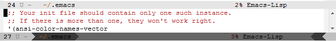

# smart-mode-line-powerline2
an alternate powerline theme for [smart-mode-line](https://github.com/Malabarba/smart-mode-line) (emacs)


## Installation
Place `smart-mode-line-powerline2-theme.el` in your theme load path (defined by variable `custom-theme-load-path`).
Append the following to your emacs init file (~/.emacs by default). `sml/theme` should be set before `(sml/setup)` is called.
```
(setq sml/theme 'powerline2)
(sml/setup)
```

## Customization
`mode-line-inactive` — inactive modeline.

`mode-line` — outer layer of active modeline.

`powerline-active1` — middle layer of active modeline.

`powerline-active2` — inner layer of active modeline.

You may need to restart for the separators to properly update.

Additionally you should have a look at the Smart Mode Line Faces customization group (`M-x customize-group smart-mode-line-faces`).

You might want to decrease the minimum of `sml/name-width` to get the inner layer text to display nearer to the separator.

Here is what it looks like with the default emacs theme:


